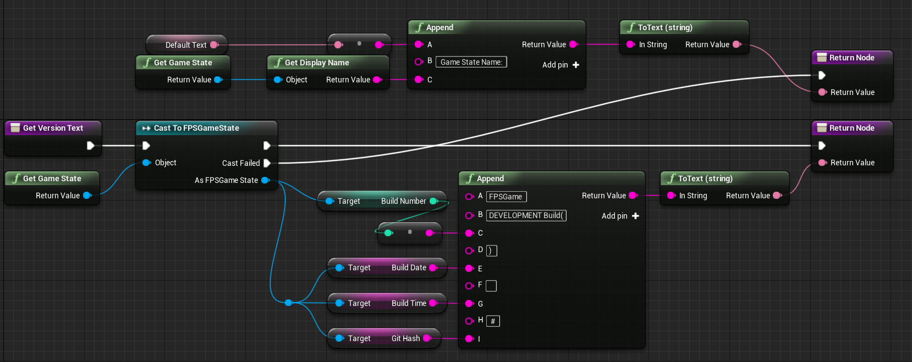
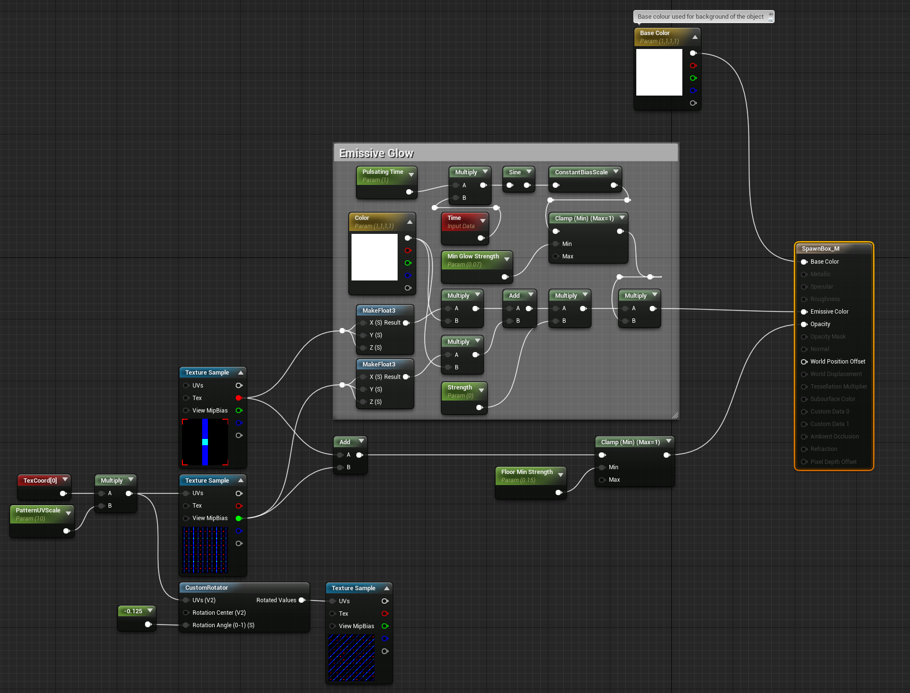

# UE4 Projects
A collection of my UE4 Projects, Many of them are tests and are not "Game" ready or might ever be. 
This repository will contain a lot of test projects which are used mainly for educational purposes such as learning or testing features.

### Projects

| Project Name  | Description | Image(s) / Video(s) |
:----:|:----:|:----:
[UE4 Mastery: First FPSGame](#ue4_mastery_first_fpsgame) | This is the first ever game I created in UE4 that was not just level design, This project was created using the udemy course (stated within its README) | 
[UE4 Mastery: Second TPS Coop Game](#UE4_Mastery_Second_TPSCoop) | The second game i've fully developed in UE4. While following the Udemy course I will be implemening additional features. | N/A

# UE4_Mastery_Second_TPSCoop
This project is just like the previous one [ue4_mastery_first_fpsgame](#ue4_mastery_first_fpsgame), I am following the course (listed below) while adding my own additions here and there. 

The goal of this project is to create a Coop (Multiplayer with possible Splitscreen support) Third Person Shooter. 
I plan to use this project as a base to learn Advanced UE4 C++ and Networking concepts. 
This project should cover most key areas such as Materials, Levels, Gameplay Logic (Such as health etc.), Animations, AI and a few more key concepts.

After this project is finished it will be used as a prototype for learning advanced level design techniques and possibly implementing more mechanics such as buildable / deployable cover etc.

# ue4_mastery_first_fpsgame 
(UE4_FPSGame_Learning)
A stepping stone project that was used as my first actual game inside UE4, The game is not pretty nor is much over what ever you would get if you followed the course (listed below). 
Although this was a project that teaches me the basics of UE4 with some simple networking through Replication.

## Learning source used
I used the following course to get a grasp on the basic features of UE4.  
[Unreal Engine 4 Mastery: Create Multiplayer Games with C++](https://www.udemy.com/unrealengine-cpp)

## Additions
I have made a few changes / additions to from the base lessons, though not all are listed here are the main ones:
- Implemented a build counter using the [UE4 Build system, FPSGameEditor.Target.cs](https://github.com/CallumCarmicheal/UE4_Learning_Projects/tree/master/ue4_mastery_first_fpsgame/Source/FPSGameEditor.Target.cs).
- Fixed projectile collisions with the shooter (this becomes a issue when networking is involved as the player is not always synced up from the projectile origin causing an overlap).
- Added build information into the GameMode then later moved into the GameState to work on all clients, these are variables that can be accessed through Blueprints to create a UI element. 
This information is stored inside [GameVersion.generated.h](https://github.com/CallumCarmicheal/UE4_Learning_Projects/tree/master/ue4_mastery_first_fpsgame/Source/FPSGame/Public/GameVersion.generated.h) 
but can be changed through editing [FPSGameEditor.Target.cs](https://github.com/CallumCarmicheal/UE4_Learning_Projects/tree/master/ue4_mastery_first_fpsgame/Source/FPSGameEditor.Target.cs).
- Added a pulsating material for the mission objective extraction zone.

## Screenshots
### Ingame

### Level design

### UIVersion Blueprint

### Pulsating Material with Properties

